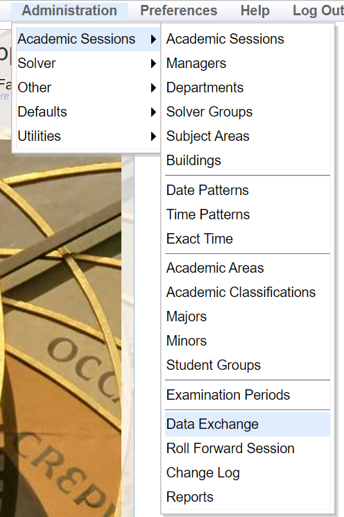

# Automated Timetabling in the School of Computer Science

# Project Details
| Project Details | |
| --- | --- |
| **Student** | Eoin McMahon 20387436 |
| **Project Supervisor** | Dr. Deepak Ajwani |
| **Project Title** | Creating time-table for the CS school modules |

# What is Unitime?

Unitime is an educational scheduling system used for high school timetabling, examination timetabling, and university curriculum timetabling. This project focuses on the latter, creating an accurate and feasible university curriculum timetable which satisfies as many hard and soft constraints as possible.

### Constraint Satisfaction within Unitime

Unitime utilises a constraint-based timetabling system, assigning weights to different preferences and aiming to discover and produce a timetable with the lowest respective weight relative to the appropriate constraints. The main constraints outlined in this project are; No core modules in a given cohort can be assigned to the same day and time slot in a timetable (prohibited), no option modules in a given cohort can be assigned to the same day and time slot in a timetable (strongly discouraged), each class should aim to be assigned to the same timetable slot as in previous years (encouraged), modules not assigned by the School of Computer Science must be given the exact time slot as in previous years (required), staff cannot be assigned to times which they are unavailable to work (prohibited) and if a lecture is 2 hours back-to-back in previous years it should aim to be given a 2 hour slot in the new produced timetable (strongly encouraged).

# What files are produced?

Through the use of Python scripts, different XML files are created which follow the appropriate syntax for Unitime. The Python first uses BeautifulSoup to scrape the offered modules in each Computer Science course. From these offered modules it scrapes the relevant information used to create the input files, including module code, module title, core or option, credits, module coordinator and more. These modules are then separated into Autumn and Spring offerings, and from these, a session file is created. This session file outlines important information about the given term, including dates and offered modules. A staff import file is created defining the appropriate staff members in a given term. An offering file is then created, outlining the classes offered and the minutes per week of each class. Lastly, a preferences file is created, mapping the relevant constraints to different classes and lecturers. This final file what Unitime focuses on when creating the timetable, trying to satisfy as many given constraints as possible.

### Where Files are Created

There are two ipynb files within this project. 

CopmuterScienceScripts.ipynb produces the required input files for Unitime forthe Computer Science undergraduate course. This produces an accurate timetable, satisfying as many constraints as possible.

FullSchoolScripts.ipynb produces the required input files for the full School of Computer Science course list, however not all classes are accounted for, as some courses do not have the full list of modules, or class assignments available. This file will be improved through future work so as to produce a full, reliable timetable for the entire School of Computer Science.

# Prerequisites

This project has been running Unitime locally, however, it is possible to deploy it to a remote server through the use of a JDBC driver. Clustering is also possible in order to run multiple instances of Unitime on a cluster of Tomcats or remote solver servers. 

Java Development Kit 11 or later is required in order to run Unitime. OpenJDK 11 and 17 are used, however, Java 8 is not supported from Unitime 4.8 or later.

[https://www.oracle.com/java/technologies/javase/jdk17-archive-downloads.html](https://www.oracle.com/java/technologies/javase/jdk17-archive-downloads.html)

Apache Tomcat is needed, version 8.5 or 9.0 are used, Apache Tomcat 10.0 is not supported in Unitime 4.5 or earlier, and Apache Tomcat 7.0 or earlier is not supported in UniTime 4.6 or later.

[https://tomcat.apache.org/download-90.cgi](https://tomcat.apache.org/download-90.cgi)

MySQL is used, where version 8.0 and Oracle version 19c are currently being used.

[https://www.mysql.com/downloads/](https://dev.mysql.com/downloads/mysql/)

Lastly, a MySQL JDBC driver is also required.

[https://dev.mysql.com/downloads/connector/j/](https://dev.mysql.com/downloads/connector/j/)

### Installing and Running Unitime

Unitime can be installed from Unitime Downloads:

[https://sourceforge.net/projects/unitime/files/UniTime 4.8/](https://sourceforge.net/projects/unitime/files/UniTime%204.8/)

After installation, it must be unzipped before running. 

Within the Unitime distribution, the timetable database must be installed. This is done within the `doc/mysql` folder, and the following commands must be run:

```bash
mysql -uroot -p -f <schema.sql
mysql -uroot -p <blank-data.sql
```

To deploy the Unitime application, you must copy `web/UniTime.war` to `Tomcat/webapps`, where `Tomcat` is the folder where Tomcat is installed. Once copied, you can then start Tomcat using `startup.bat` and the Unitime application should be available at [http://localhost:8080/UniTime](http://localhost:8080/UniTime) or [https://localhost:8443/UniTime](https://localhost:8443/UniTime) when SSL connector is enabled.
Once running, you can log in to the application using username “admin” and password “admin”.

The required files are then inputted within the Administration → Academic Session → Data Exchange section of the application.



Firstly, the permissions.xml file must be inputted. This grants the admin full access permissions to utilize the solver and change information within the application UI.

This is followed by the new files produced through the python scripts in the following order (Using the Autumn trimester as an example):
AutumnSession.xml → AutumnStaffImport.xml → AutumnOffering.xml → AutumnPreferencesFinal.xml

Once all files have been inputted, you must sign out in order to sign back in with the new full admin privileges. You can then switch to the new session provided in the input files, by clicking “change the session or role”, and then selecting the newly created academic session.


Although possible, building and room types have not been created, and hence, mock buildings and rooms must be inputted manually in order to run the timetable. 

Buildings are located under Administration → Academic Sessions → Buildings section, where it is possible to add buildings, with the required fields being Abbreviation, Name and External Id.


Rooms must be added within the Courses → Input Data → Rooms section, where the required fields are Room type, building, room number, and capacity.


Within courses → input data, it is possible to check the inputted information is correct, with options to view classes, instructors and distributed preferences 


Lastly, in order to create a timetable, data must be loaded into the timetabling solver, within Courses → Course Timetabling → Solver


Within this solver, data must be loaded, and then the solver started. Unitime will then begin solving for the timetable which satisfies the most constraints, and will save this timetable to Saved Timetables.

Once the solver has completed, a timetable can be seen within the Timetable Grid section. Classes can be changed once a timetable has been created, with Unitime showing if a change violates any constraints. 

Conflict Statistics gives an in depth overview of the constraints which were not satisfied, and offers potential changes if needed.

## Acknowledgements

This project was developed by Eoin McMahon as an Undergraduate Computer Science Final Year Project, under the supervision of Dr. Deepak Ajwani.